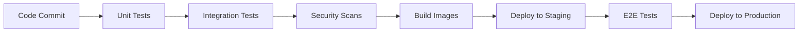

# 🚀 SpaceShield DevOps Implementation

<div align="center">
  
  
  
  
</div>

## 📊 DevOps Architecture


## 🛠️ Technology Stack

<div align="center">
  <table>
    <tr>
      <th>Category</th>
      <th>Technologies</th>
    </tr>
    <tr>
      <td><strong>Containerization</strong></td>
      <td>
        
        
      </td>
    </tr>
    <tr>
      <td><strong>Orchestration</strong></td>
      <td>
        
        
      </td>
    </tr>
    <tr>
      <td><strong>CI/CD</strong></td>
      <td>
        
      </td>
    </tr>
    <tr>
      <td><strong>Monitoring</strong></td>
      <td>
        
        
      </td>
    </tr>


 
  </table>
</div>

## 📋 Current Implementation Status

### ✅ Completed Tasks

| Component | Status | Description |
|-----------|--------|-------------|
| 🐳 **Docker Containerization** | ✅ Complete | All services containerized with optimized Dockerfiles |
| 📦 **Multi-stage Builds** | ✅ Complete | Optimized build process for frontend and backend |
| 🔗 **Docker Compose** | ✅ Complete | Local development environment with all services |
| ☸️ **Kubernetes Deployment** | ✅ Complete | Production-ready K8s manifests with proper configurations |
| 🔧 **Service Discovery** | ✅ Complete | Internal service communication via K8s services |
| 💾 **Persistent Storage** | ✅ Complete | MySQL data persistence with PVC |
| 🌐 **Load Balancing** | ✅ Complete | NodePort services for external access |
| 🔨 **Jenkins Setup** | ✅ Complete | CI/CD server with Docker integration |

### 🚧 In Progress

| Component | Status | Description |
|-----------|--------|-------------|
| 🚀 **CI/CD Pipeline** | 🔄 In Progress | Automated build, test, and deployment pipeline |
| 📊 **Health Checks** | 🔄 In Progress | Kubernetes liveness and readiness probes |
| 🔄 **Auto-scaling** | 🔄 In Progress | HPA configuration for dynamic scaling |

### 🎯 Next Steps (Roadmap)

| Priority | Component | Timeline | Description |
|----------|-----------|----------|-------------|
| 🔥 **High** | 📊 **Monitoring Setup** | Week 1-2 | Prometheus + Grafana for metrics and alerting |
| 🔥 **High** | 📝 **Logging Stack** | Week 2-3 | ELK Stack for centralized logging |
| 🔥 **High** | 🔐 **Security Hardening** | Week 3-4 | RBAC, network policies, secret management |
| 🟡 **Medium** | 🚀 **GitOps** | Week 4-5 | ArgoCD for automated deployments |
| 🟡 **Medium** | 🧪 **Testing Automation** | Week 5-6 | Integration and E2E testing in pipeline |
| 🟢 **Low** | 🌍 **Multi-environment** | Week 6-7 | Dev, Staging, Production environments |
| 🟢 **Low** | ☁️ **Cloud Migration** | Week 7-8 | AWS/Azure/GCP deployment |

## 🏗️ Project Structure

```
HamalouiSpaceEnd/
├── 📁 frontend/                    # React TypeScript application
│   ├── 📄 Dockerfile              # Multi-stage build for production
│   ├── 📄 package.json            # Dependencies and scripts
│   └── 📁 src/                    # Source code
├── 📁 backend/                     # Spring Boot application
│   ├── 📄 Dockerfile              # Java 21 runtime container
│   ├── 📄 pom.xml                 # Maven dependencies
│   └── 📁 src/                    # Source code
├── 📁 jenkins/                     # CI/CD configuration
│   └── 📄 Dockerfile.jenkins      # Custom Jenkins image
├── 📁 k8s/                        # Kubernetes manifests
│   ├── 📄 namespace.yaml          # Namespace definition
│   ├── 📄 mysql-deployment.yaml   # Database deployment
│   ├── 📄 backend-deployment.yaml # API deployment
│   ├── 📄 frontend-deployment.yaml# Frontend deployment
│   └── 📄 orekit-*.yaml          # Persistent volumes
├── 📁 monitoring/                  # Monitoring configurations (Next)
│   ├── 📄 prometheus.yml          # Metrics collection
│   └── 📄 grafana-dashboard.json  # Visualization dashboards
├── 📁 scripts/                    # Deployment automation
│   ├── 📄 deploy.bat              # Windows deployment script
│   └── 📄 cleanup.bat             # Environment cleanup
├── 📁 orekit-data-main           # Orekit Data 
├── 📄 docker-compose.yml          # Local development environment
|── 📄 Jenkinsfile          # Jenkins file
└── 📄 .env                       # Environment variables
```

## 🚀 Deployment Guide

### Prerequisites

- ✅ Docker Desktop with Kubernetes enabled
- ✅ kubectl CLI tool
- ✅ Git repository access
- ✅ 8GB+ RAM for local development

### Quick Start

1. **Clone the repository**
   ```bash
   git clone <repository-url>
   cd HamalouiSpaceEnd
   ```

2. **Local Development with Docker Compose**
   ```bash
   # Start all services locally
   docker-compose up --build -d
   
   # Access services
   # Frontend:  http://localhost:3001
   # Backend:   http://localhost:8080
   # Jenkins:   http://localhost:8088
   # MySQL:     localhost:3316
   ```

3. **Production Deployment with Kubernetes**
   ```bash
   # Deploy to Kubernetes
   .\complete-k8s-deployment.bat
   
   # Access services
   # Frontend:  http://localhost:30001
   # Jenkins:   http://localhost:30088
   ```

## 📊 Monitoring & Observability (Planned)

### Metrics Collection
- **Application Metrics**: Custom business metrics from Spring Boot Actuator
- **Infrastructure Metrics**: CPU, Memory, Network, Disk usage
- **Container Metrics**: Docker container performance metrics
- **Kubernetes Metrics**: Pod, Service, Node metrics

### Dashboards
- **Application Performance**: Response times, error rates, throughput
- **Infrastructure Health**: Resource utilization, capacity planning
- **Business Metrics**: Space debris tracking statistics
- **Alerting**: Critical system and application alerts

### Log Management
- **Centralized Logging**: All application and system logs
- **Log Aggregation**: Structured logging with correlation IDs
- **Search & Analysis**: Full-text search and log analysis
- **Retention**: Configurable log retention policies

## 🔐 Security Implementation (Planned)

| Security Layer | Implementation | Status |
|----------------|---------------|--------|
| **Container Security** | Non-root users, minimal base images | ✅ Implemented |
| **Network Security** | Network policies, service mesh | 📋 Planned |
| **Secrets Management** | Kubernetes secrets, encryption | 📋 Planned |
| **Image Scanning** | Vulnerability scanning in CI/CD | 📋 Planned |
| **Runtime Security** | Security policies, admission controllers | 📋 Planned |

## 🧪 Testing Strategy (Planned)

### Automated Testing Pipeline


### Test Coverage
- **Unit Tests**: Individual component testing
- **Integration Tests**: Service-to-service communication
- **API Tests**: REST API endpoint testing
- **E2E Tests**: Full user workflow testing
- **Performance Tests**: Load and stress testing
- **Security Tests**: Vulnerability and penetration testing

## 📈 Performance Optimization

### Current Optimizations
- ✅ Multi-stage Docker builds for minimal image sizes
- ✅ Resource limits and requests in Kubernetes
- ✅ Efficient database indexing and queries
- ✅ Frontend code splitting and lazy loading

### Planned Optimizations
- 📋 CDN integration for static assets
- 📋 Database connection pooling optimization
- 📋 Caching layers (Redis) for API responses
- 📋 Horizontal Pod Autoscaling (HPA)
- 📋 Cluster autoscaling for cost optimization

## 🌍 Multi-Environment Strategy (Planned)

| Environment | Purpose | Access | Auto-Deploy |
|-------------|---------|--------|-------------|
| **Development** | Feature development | Developers | On commit |
| **Staging** | Integration testing | QA Team | On PR merge |
| **Production** | Live system | End users | Manual approval |

## 👥 Team

<div align="center">
  <table>
    <tr>
      <td align="center" width="25%">
        <br>
        <b>ELGARCH Youssef</b><br>
        <small>2A Junior Software Engineer at ENSIAS</small><br>
        <a href="https://github.com/yousef-elgarch1">
          
        </a>
      </td>
      <td align="center" width="25%">
        <br>
        <b>IBNOU-KADY Nisrine</b><br>
        <small>2A Junior Software Engineer at ENSIAS</small><br>
        <a href="https://github.com/nisrine2002">
          
        </a>
      </td>
      <td align="center" width="25%">
        <br>
        <b>BAZZAOUI Youness</b><br>
        <small>2A Junior Software Engineer at ENSIAS</small><br>
        <a href="https://github.com/Younrun">
          
        </a>
      </td>
      <td align="center" width="25%">
        <br>
        <b>TOUZANI Youssef</b><br>
        <small>2A Junior Software Engineer at ENSIAS</small><br>
        <a href="https://github.com/Yousseftouzani1">
          
        </a>
      </td>
    </tr>
  </table>
</div>

## 🆘 Troubleshooting

### Common Issues

<details>
<summary>🐳 Docker Issues</summary>

- **Container won't start**: Check logs with `docker logs <container-name>`
- **Port conflicts**: Ensure ports 3001, 8080, 8088, 3316 are available
- **Build failures**: Clear Docker cache with `docker system prune`
</details>

<details>
<summary>☸️ Kubernetes Issues</summary>

- **Pods stuck in Pending**: Check resource constraints with `kubectl describe pod`
- **ImagePullBackOff**: Ensure images are built locally with `imagePullPolicy: Never`
- **Service not accessible**: Verify service and endpoint configuration
</details>

<details>
<summary>🔨 Jenkins Issues</summary>

- **Jenkins won't start**: Check Docker socket permissions
- **Build failures**: Verify Jenkins has access to Docker daemon
- **Plugin issues**: Update Jenkins plugins to latest versions
</details>

## 📚 Additional Resources

- [Docker Best Practices](https://docs.docker.com/develop/best-practices/)
- [Kubernetes Documentation](https://kubernetes.io/docs/)
- [Jenkins Pipeline Documentation](https://www.jenkins.io/doc/book/pipeline/)
- [Prometheus Monitoring](https://prometheus.io/docs/)
- [Grafana Dashboards](https://grafana.com/docs/)

## 🏆 Success Metrics

| Metric | Current | Target |
|--------|---------|--------|
| **Deployment Time** | Manual (30min) | Automated (5min) |
| **System Uptime** | Manual monitoring | 99.9% |
| **Mean Time to Recovery** | Unknown | < 15 minutes |
| **Build Success Rate** | Manual builds | > 95% |
| **Test Coverage** | Limited | > 80% |

---

<div align="center">
  <strong>🚀 SpaceShield DevOps Implementation - Building the Future of Space Debris Monitoring</strong>
</div>
