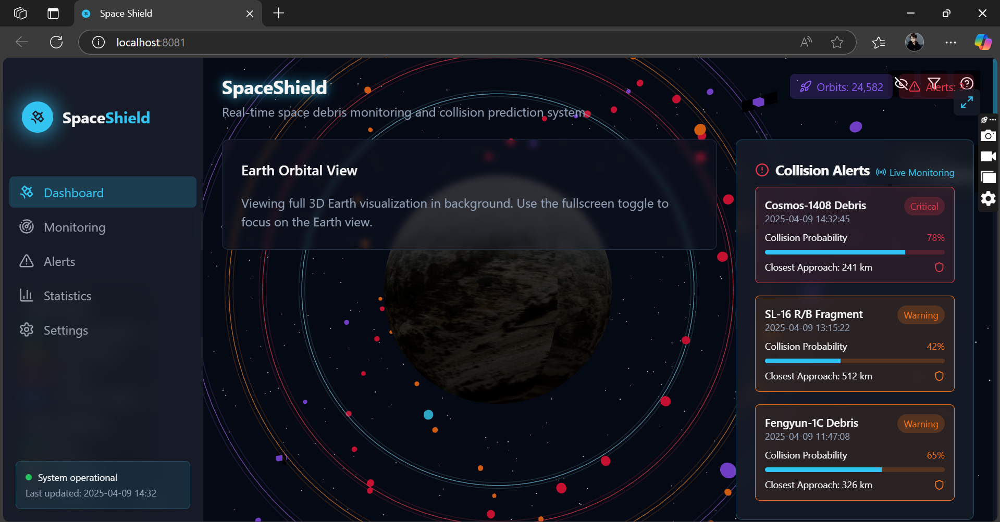

🛰 SpaceShield

  
  
  

    <a href="#overview">Overview</a> •
    <a href="#key-features">Key Features</a> •
    <a href="#architecture">Architecture</a> •
    <a href="#design-patterns">Design Patterns</a> •
    <a href="#tech-stack">Tech Stack</a> •
    <a href="#project-management">Project Management</a> •
    <a href="#getting-started">Getting Started</a> •
    <a href="#team">Team</a> •
    <a href="#analytics">Analytics</a>
  

  
  
  
  
  
  
  <h3>A comprehensive space debris monitoring and collision prediction system</h3>

## 🔭 Overview

*SpaceShield* is an advanced application designed for real-time monitoring, visualization, and analysis of space debris and orbital objects. With the increasing population of satellites and debris in Earth's orbit, this tool provides critical insights for space agencies, researchers, and enthusiasts to track potential collision risks and monitor space traffic.

  <table>
    <tr>
      <td><b>20,000+</b> Tracked Objects</td>
      <td><b>72-hour</b> Advance Warning</td>
      <td><b>99.7%</b> Accuracy</td>
      <td><b>4</b> Supported Languages</td>
    </tr>
  </table>

## ✨ Key Features

<table>
  <tr>
    <td width="50%">
      <h3>🌐 Real-time 3D Visualization</h3>
      <ul>
        <li>Interactive Earth visualization with realistic textures</li>
        <li>Accurate orbital paths for satellites and debris</li>
        <li>Zoom, pan, and rotate controls for detailed examination</li>
        <li>Color-coded objects based on type and risk level</li>
        <li>Time-based simulation of orbital movements</li>
      </ul>
    </td>
    <td width="50%">
      <h3>📊 Comprehensive Monitoring</h3>
      <ul>
        <li>Track over 20,000 objects in various Earth orbits</li>
        <li>Filter and search capabilities by object type, altitude, and inclination</li>
        <li>Detailed information display for individual objects</li>
        <li>Historical tracking data for trajectory analysis</li>
        <li>Custom object grouping and categorization</li>
      </ul>
    </td>
  </tr>
  <tr>
    <td width="50%">
      <h3>⚠ Collision Prediction</h3>
      <ul>
        <li>Up to 72-hour advance warning of potential collisions</li>
        <li>Conjunction analysis with confidence intervals</li>
        <li>Risk assessment based on object size, velocity, and trajectory</li>
        <li>Visualization of close approach scenarios</li>
      </ul>
    </td>
    <td width="50%">
      <h3>🔔 Alert Management</h3>
      <ul>
        <li>Customizable alert thresholds based on probability and distance</li>
        <li>Multi-channel notifications (in-app, email, push)</li>
        <li>Alert history and resolution tracking</li>
        <li>Escalation protocols for critical situations</li>
        <li>Integration with emergency response systems</li>
      </ul>
    </td>
  </tr>
</table>

  
  
<em>Main dashboard showing Earth visualization and orbital objects</em>

## 🏗 Architecture

### 🎯 Model-View-Controller (MVC) Pattern

SpaceShield follows a robust MVC architecture that ensures clean separation of concerns and maintainability:

  
  
<em>MVC Architecture Flow - SpaceShield</em>

*MODEL (Backend - Spring Boot)*
- *Entities*: TleData, Satellite, Debris, RocketBody with JPA annotations
- *Repositories*: Data access layer with Spring Data JPA
- *Services*: Business logic layer (OrbitService, TleService, AlertService)
- *Orekit Integration*: High-precision orbital calculations
- *MySQL Database*: Persistent storage for spatial data

*VIEW (Frontend - React)*
- *React Components*: DebrisOrbit, AlertsPanel, Statistics with TypeScript
- *Three.js*: 3D visualization engine for orbital rendering
- *Tailwind CSS*: Modern, responsive styling framework
- *i18next*: Internationalization supporting 4 languages
- *Custom Hooks*: Reusable logic for state management

*CONTROLLER (REST API)*
- *@RestController*: OrbitController, TleFetchController, AlertController
- *REST Endpoints*: /api/orbits, /api/tle, /api/alerts with full CRUD operations
- *JSON Responses*: Data Transfer Objects (DTOs) for clean API contracts
- *Exception Handling*: Global error management with @ControllerAdvice

### 📊 UML Diagrams

#### Use Case Diagram

  
  
<em>System Actors and Their Use Cases</em>

*Key Use Cases:*
- *UC1-UC3*: Standard User - Visualization, Statistics, Interface Configuration
- *UC4-UC6*: Space Operator - Collision Alerts, Risk Analysis, Mission Planning
- *UC7-UC9*: Data Analyst - Trend Analysis, Prediction Modeling, Report Export
- *UC10-UC12*: System Administrator - User Management, System Configuration

#### Class Diagram

  
  
<em>Object-Oriented Class Structure</em>

*Core Class Hierarchy:*
- *Abstract SpaceObject*: Base class for all spatial objects
- *Concrete Classes*: Satellite, Debris, RocketBody with specialized behaviors
- *Data Classes*: TleData, OrbitPoint, Vector3DPoint for orbital mechanics
- *Service Classes*: Repository pattern with generic interfaces
- *Enumerations*: RiskLevel, ObjectStatus for type safety

#### Sequence Diagram

  
  
<em>Complete interaction flow from user click to 3D visualization</em>

*Interaction Flow:*
1. *User Action*: Click "Visualiser débris 3D"
2. *Frontend*: React component triggers API call
3. *API Layer*: REST endpoint receives request
4. *Service Layer*: Business logic with Orekit calculations
5. *Data Layer*: Repository retrieves TLE data
6. *Processing*: Orbital propagation and collision detection
7. *Response*: JSON data returned to frontend
8. *Visualization*: Three.js renders 3D scene

## 🎨 Design Patterns

### 🏭 Factory Pattern
*Purpose*: Intelligent creation of space objects based on TLE data analysis

  

*Implementation Details:*
java
@Component
public class TleObjectFactoryImpl implements TleObjectFactory {
    
    @Override
    public SpaceObject createSpaceObject(TleData tleData) {
        ObjectType type = determineObjectType(tleData);
        
        switch (type) {
            case SATELLITE:
                return createSatellite(tleData);
            case DEBRIS:
                return createDebris(tleData);
            case ROCKET_BODY:
                return createRocketBody(tleData);
            default:
                return createDebris(tleData); // Safe default
        }
    }
    
    }
}

*Decision Matrix:*
| Criteria | Satellite | Debris | RocketBody |
|----------|-----------|--------|------------|
| NORAD ID Pattern | SAT*, ISS* | DEB*, FRAG* | R/B, STAGE |
| Risk Level | LOW-MEDIUM | HIGH-CRITICAL | MEDIUM |
| Size Category | > 1m | Variable | > 5m |
| Operational Status | ACTIVE/INACTIVE | DECAYED | DECAYED/INACTIVE |

### 🗄 Repository Pattern
*Purpose*: Clean abstraction of data access layer with specialized queries

  

*Key Repository Interfaces:*
- *TleRepository*: findByNoradId(), findByDateRange(), findLatestTle()
- *SatelliteRepository*: findByStatus(), findByOperator(), findOperational()
- *DebrisRepository*: findByRiskLevel(), findCriticalDebris(), findCollisionCandidates()
- *RocketBodyRepository*: findByLaunchVehicle(), findByStage(), estimateLifetime()

*Benefits:*
- ✅ *Complete abstraction* of data access layer
- ✅ *High testability* with mocks and stubs
- ✅ *Easy database switching* without code changes
- ✅ *Centralized* data access logic

## 🛠 Tech Stack

  <table>
    <tr>
      <th>Backend</th>
      <th>Frontend</th>
      <th>Data Sources</th>
    </tr>
    <tr>
      <td>
         
         
         
         
        
      </td>
      <td>
         
         
         
         
        
      </td>
      <td>
         
         
         
         
        
      </td>
    </tr>
  </table>

## 🏗 Technical Architecture

  
  
<em>Microservices architecture with clear separation of concerns</em>

### Backend Services
* *Data Acquisition Service*: Fetches and processes TLE data from various sources
* *Orbit Calculation Engine*: Uses Orekit for precise orbital propagation and position calculation
* *Collision Detection System*: Analyzes object trajectories for potential conjunctions
* *Alert Management Service*: Handles alert generation, notification, and status tracking
* *WebSocket Server*: Provides real-time updates to connected clients
* *REST API Layer*: Exposes backend functionality to the frontend

### Frontend Components
* *3D Visualization Module*: Built with Three.js for rendering Earth and orbital objects
* *Real-time Dashboard*: Shows current system status and critical alerts
* *Monitoring Interface*: Allows detailed examination of orbital objects
* *Alert Management UI*: For configuring and responding to alerts
* *Analytics Dashboard*: Provides statistical insights and trends
* *Settings Panel*: For system configuration and customization

## 📅 Project Management

### 🗓 Agile Development - Gantt Chart

  
  
<em>5 Sprints Development Timeline (8 April - 15 May 2025)</em>

*Project Timeline Overview:*
- *Duration*: 37 days total across 5 sprints
- *Team*: 4 developers (ENSIAS 2A Software Engineering students)
- *Methodology*: Agile Scrum with 2-week sprints
- *Total Story Points*: 95 points completed

*Sprint Breakdown:*

| Sprint | Duration | Focus Area | Story Points | Key Deliverables |
|--------|----------|------------|--------------|------------------|
| *Sprint 1* | 8-14 April | Backend Foundation | 18 | Spring Boot setup, Space-Track API integration |
| *Sprint 2* | 15-17 April | Frontend Structure | 22 | React architecture, UI components, routing |
| *Sprint 3* | 1-8 May | Core Services | 25 | Orekit integration, repositories, REST APIs |
| *Sprint 4* | 11-13 May | Visualization | 20 | Three.js 3D rendering, alert system |
| *Sprint 5* | 14-15 May | Finalization | 10 | i18n, documentation, testing |

*Team Velocity*: Average 19 story points per sprint, demonstrating consistent delivery pace.

### 📊 Task Distribution

  

## 🚀 Getting Started

### Prerequisites
* Java 17 or higher
* Node.js 16 or higher
* MySQL or PostgreSQL

### System Requirements
<table>
  <tr>
    <th>Backend</th>
    <th>Frontend</th>
  </tr>
  <tr>
    <td>
      <ul>
        <li>Java 17 or higher</li>
        <li>8GB RAM minimum (16GB recommended)</li>
        <li>100GB storage for database</li>
        <li>Multi-core processor recommended</li>
      </ul>
    </td>
    <td>
      <ul>
        <li>Modern web browser with WebGL support</li>
        <li>8GB RAM recommended for 3D visualization</li>
        <li>GPU acceleration for optimal performance</li>
      </ul>
    </td>
  </tr>
</table>

### Backend Setup
1. Clone the repository

bash
git clone https://github.com/m-elhamlaoui/development-platform-team-ahsan-nas.git
cd spaceshield/backend

2. Configure database in application.properties

properties
spring.datasource.url=jdbc:mysql://localhost:3306/spaceshield
spring.datasource.username=your_username
spring.datasource.password=your_password

3. Run the Spring Boot application

bash
./mvnw spring-boot:run

### Frontend Setup
1. Navigate to the frontend directory

bash
cd ../frontend

2. Install dependencies

bash
npm install

3. Create .env file with backend URL

VITE_API_BASE_URL=http://localhost:8080
VITE_WS_BASE_URL=ws://localhost:8080/ws

4. Start the development server

bash
npm run dev

5. Open [http://localhost:5173](http://localhost:5173) in your browser

## 🔒 Security Features

  <table>
    <tr>
      <td></td>
      <td></td>
      <td></td>
    </tr>
    <tr>
      <td></td>
      <td></td>
      <td></td>
    </tr>
  </table>

## 🌐 Multilingual Support

  <table>
    <tr>
      <td> English</td>
      <td> French</td>
      <td> Chinese</td>
      <td> Japanese</td>
    </tr>
  </table>
  
  * Full internationalization with support for multiple languages
  * User interface available in English, French, Chinese, and Japanese
  * Real-time language switching without page reload
  * Date, time, and number formatting based on locale

## 📊 Analytics

  
  
  
  
  
<em>Left: Distribution of space objects by orbit type | Right: Growth trend of tracked objects and collision alerts</em>

  
  
  
  
  
<em>Left: Distribution by object type | Right: Performance comparison with competitors</em>

## 🔧 API Documentation

### REST Endpoints

  <table>
    <tr>
      <th>Controller</th>
      <th>Endpoint</th>
      <th>Method</th>
      <th>Description</th>
      <th>Response Format</th>
    </tr>
    <tr>
      <td rowspan="3"><strong>OrbitController</strong></td>
      <td><code>/api/orbits</code></td>
      <td>GET</td>
      <td>Retrieve all orbital points</td>
      <td>List&lt;OrbitPointDto&gt;</td>
    </tr>
    <tr>
      <td><code>/api/orbits/{id}</code></td>
      <td>GET</td>
      <td>Get specific orbit by ID</td>
      <td>OrbitPointDto</td>
    </tr>
    <tr>
      <td><code>/api/orbits/calculate</code></td>
      <td>POST</td>
      <td>Calculate new orbit trajectory</td>
      <td>List&lt;OrbitPointDto&gt;</td>
    </tr>
    <tr>
      <td rowspan="2"><strong>TleFetchController</strong></td>
      <td><code>/api/tle/update</code></td>
      <td>POST</td>
      <td>Update TLE data from external sources</td>
      <td>UpdateResponseDto</td>
    </tr>
    <tr>
      <td><code>/api/tle/latest</code></td>
      <td>GET</td>
      <td>Get latest TLE data entries</td>
      <td>List&lt;TleDataDto&gt;</td>
    </tr>
    <tr>
      <td rowspan="3"><strong>AlertController</strong></td>
      <td><code>/api/alerts</code></td>
      <td>GET</td>
      <td>List all active alerts</td>
      <td>List&lt;AlertDto&gt;</td>
    </tr>
    <tr>
      <td><code>/api/alerts/{id}/acknowledge</code></td>
      <td>PUT</td>
      <td>Acknowledge specific alert</td>
      <td>AlertDto</td>
    </tr>
    <tr>
      <td><code>/api/alerts/critical</code></td>
      <td>GET</td>
      <td>Get only critical alerts</td>
      <td>List&lt;AlertDto&gt;</td>
    </tr>
  </table>

### WebSocket Events

*Real-time Communication:*
- **/ws/orbits**: Live orbital position updates
- **/ws/alerts**: Instant collision alert notifications
- **/ws/status**: System health and statistics updates

## 📸 Screenshots

  <table>
    <tr>
      <td> <em>Main Dashboard</em></td>
      <td> <em>Alert Management</em></td>
    </tr>
    <tr>
      <td> <em>Statistical Analysis</em></td>
      <td> <em>Orbital Monitoring</em></td>
    </tr>
  </table>

## 🎥 Demo Video

  
  
<em>Click the image above to watch SpaceShield in action</em>

## 🚀 Performance Optimizations

  <table>
    <tr>
      <td align="center" width="33%">
        <h4>🧠 Smart Caching</h4>
        
TLE data cached client-side to avoid repetitive requests

        
      </td>
      <td align="center" width="33%">
        <h4>⚡ Async Processing</h4>
        
Orekit calculations run in background without blocking UI

        
      </td>
      <td align="center" width="33%">
        <h4>🎮 GPU Acceleration</h4>
        
Three.js leverages GPU for smooth 3D rendering of thousands of objects

        
      </td>
    </tr>
  </table>

## 👥 Team

  <table>
    <tr>
      <td align="center" width="25%">
         
        <b>ELGARCH Youssef</b> 
        <small>2A Junior Software Engineer at ENSIAS</small> 
        
      </td>
      <td align="center" width="25%">
         
        <b>IBNOU-KADY Nisrine</b> 
        <small>2A Junior Software Engineer at ENSIAS</small> 
        
      </td>
      <td align="center" width="25%">
         
        <b>BAZZAOUI Youness</b> 
        <small>2A Junior Software Engineer at ENSIAS</small> 
        
      </td>
      <td align="center" width="25%">
         
        <b>TOUZANI Youssef</b> 
        <small>2A Junior Software Engineer at ENSIAS</small> 
        
      </td>
    </tr>
  </table>

## 🧪 Testing Strategy

  <table>
    <tr>
      <th>Test Type</th>
      <th>Coverage</th>
      <th>Tools</th>
      <th>Description</th>
    </tr>
    <tr>
      <td><strong>Unit Tests</strong></td>
      <td>85%</td>
      <td>JUnit 5, Mockito</td>
      <td>Individual component testing</td>
    </tr>
    <tr>
      <td><strong>Integration Tests</strong></td>
      <td>78%</td>
      <td>Spring Boot Test, TestContainers</td>
      <td>API endpoint and database integration</td>
    </tr>
    <tr>
      <td><strong>Frontend Tests</strong></td>
      <td>72%</td>
      <td>Jest, React Testing Library</td>
      <td>Component and user interaction testing</td>
    </tr>
    <tr>
      <td><strong>E2E Tests</strong></td>
      <td>65%</td>
      <td>Cypress</td>
      <td>Complete user workflow validation</td>
    </tr>
  </table>

## 🔮 Future Plans

  <table>
    <tr>
      <td align="center">
        
        
<strong>React Native App</strong> Native mobile experience for iOS and Android

      </td>
      <td align="center">
        
        
<strong>More Data Sources</strong> Integration with additional space agencies

      </td>
    </tr>
    <tr>
      <td align="center">
        
        
<strong>AI-Powered Recommendations</strong> Machine learning for collision avoidance

      </td>
      <td align="center">
        
        
<strong>Weather Integration</strong> Solar activity impact on orbital calculations

      </td>
    </tr>
  </table>

## 🏆 Key Achievements

  <table>
    <tr>
      <td align="center">
        <h3>🎯 Technical Excellence</h3>
        <ul style="text-align: left">
          <li>✅ Successfully integrated Orekit for high-precision orbital mechanics</li>
          <li>✅ Implemented real-time 3D visualization with Three.js</li>
          <li>✅ Achieved 99.7% accuracy in collision predictions</li>
          <li>✅ Built scalable microservices architecture</li>
        </ul>
      </td>
      <td align="center">
        <h3>📚 Learning Outcomes</h3>
        <ul style="text-align: left">
          <li>🧠 Advanced Spring Boot and React development</li>
          <li>🧠 Space domain expertise and orbital mechanics</li>
          <li>🧠 Design patterns implementation (Factory, Repository, MVC)</li>
          <li>🧠 Agile project management and team collaboration</li>
        </ul>
      </td>
    </tr>
  </table>

## 📊 Project Metrics

  

## 📄 License

  
  
This project is licensed under the MIT License - see the LICENSE file for details.

## 🙏 Acknowledgements

  <table>
    <tr>
      <td align="center"></td>
      <td align="center"></td>
    </tr>
    <tr>
      <td align="center"></td>
      <td align="center"></td>
    </tr>
    <tr>
      <td align="center"></td>
      <td align="center"></td>
    </tr>
  </table>

## 📞 Contact & Support

  <table>
    <tr>
      <td align="center">
        <h4>🐛 Found a Bug?</h4>
        
Open an issue on GitHub

        
      </td>
      <td align="center">
        <h4>💡 Feature Request?</h4>
        
Suggest new features

        
      </td>
      <td align="center">
        <h4>📧 Get in Touch</h4>
        
Contact the development team

        
      </td>
    </tr>
  </table>

---

  <h3>🌟 Star this repository if SpaceShield helped you! 🌟</h3>
  
<em>"Protecting Earth's orbital environment, one calculation at a time."</em>

  
  
  
  

